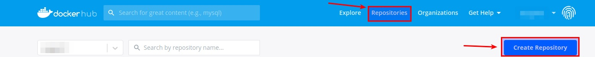
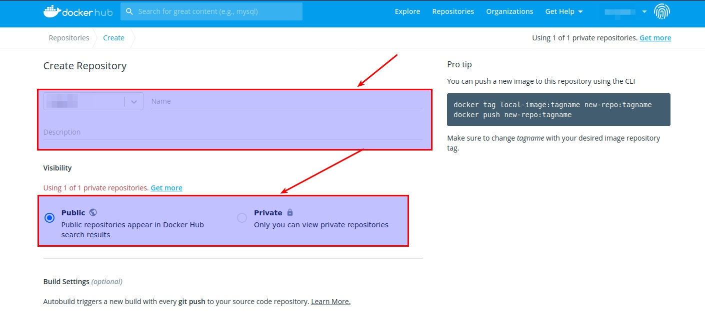

Podemos subir una imágen a un repositorio (por defecto Docker Hub). Para ello, primero debemos crearnos una cuenta en [Docker Hub](https://hub.docker.com/).

Una vez creada la cuenta y no hayamos logueado, debemos acceder a Repositories y en Create repository como se ve en la imagen:

A continuación, crearemos un repositorio y eligiremos si nuestro repositorio es público
(cualquiera puede acceder) o privado (sólo puede acceder el dueño o autorizados).
La pantalla de creación del repositorio es la siguiente:

Una vez tenganos el repositorio creado tenemos que logearnos a nuestra cuenta a través de la consola de nuestro equipo mediante el comando:

    docker login

Una vez logueado, debemos hacer un “commit” local de la imagen, siguiendo la estructura vista en el punto anterior. Un ejemplo podría ser:

    docker commit -a "paco" -m "Apache con nano" IDCONTENEDOR framafra/apachenano:latest

donde,  
***framafra*** *es el nombre de usuario de la cuenta de Docker Hub* 
***apachenano*** *es el nombre de la imagen* 
***latest*** *es la etiqueta de la imagen*

Y por último, para subirlo  este commit local, debemos subirlo usando “docker push”

    docker push framafra/apachenano

Una vez hecho eso, si la imagen es pública, cualquiera podrá descargarla y crear contenedores usando “docker pull” o “docker run”.

Más información de los comandos:

-   Docker login [https://docs.docker.com/engine/reference/commandline/login/]( https://docs.docker.com/engine/reference/commandline/login/)
-   Docker push [https://docs.docker.com/engine/reference/commandline/push/](https://docs.docker.com/engine/reference/commandline/push/)

